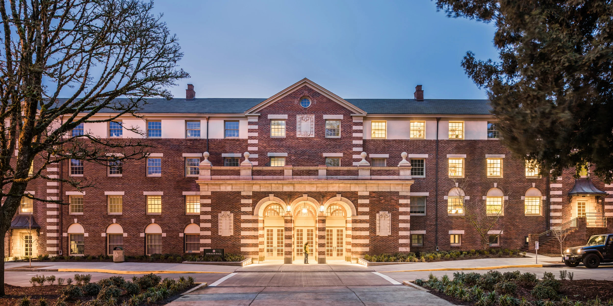

  \

In the Spring of 2018, I taught a PSY 607 seminar called *Data Science Methods for Psychology*. This course was indented to introduce students to topics, concepts, and workflows that are commonplace in “data science” more generally but are less formally discussed in Psychology. Each week, a pair of students would lead a tutorial session on a given topic before assigning a "mini-hackathon" project for the rest of the class to complete over the coming week. These presentations were consistently excellent, and it would be a shame if I was the only one who got to see them. As such, I thought they might make a useful resource for others in the department (and beyond) who are looking to increase their knowledge of these particular topics or dig in a little deeper with their R skills with relevant information home brewed right here in the UO [Department of Psychology](https://psychology.uoregon.edu/) by our peers. Additionally on this page, you will also find the custom R package ["psychduck"](psychduck.html) which was collectively created in the class, as well as the course syllabus.   

Below are links to the tutorials created for each topic covered in our course.

### [General Programming in R](html_only/general_programming.html)
### [Data Wrangling](html_only/data_wrangling.html)
### [Data Visualization](html_only/data_visualization.html)
### [Text Processing](html_only/text_processing.html)
### [Web Scraping](html_only/web_scraping.html)
### [Machine Learning](html_only/machine_learning_basics.html)
### [Network Analysis](html_only/network_analysis.html)
### [Package Creation](html_only/packages.html)
### [Website Building in R](html_only/websites.html)

 
 

## New tutorials for 2026

Below are the tutorials for this course from students in my class from Spring of 2026. Many of the same topics with lots of updates to keep up with changes over the past eight years. Here is the [updated syllabus](html_only/PSY607_datascience_syllabus_S26.html).
 

### [General Programming in R](html_only/week2_general_programming.html)
### [Custom Functions](html_only/week3_custom_functions.html)
### [Data Wrangling](html_only/Week4_datawrangling_GN.html)
### [Data Visualization](html_only/Week5_DataViz.html)
### [Text Processing](html_only/Week6_text_processing.html)
### [Machine Learning](html_only/Week7_machine_learning.html)
### [Network Analysis](html_only/Week8_Network_Science.html)
### [Web Scraping](html_only/Week9_Web Scraping.html)